# CrimeGuard Software

**A Windows desktop crime analysis and prison-management system built in C# for a full Software Engineering sprint project.**

CrimeGuard is a desktop application designed to help law-enforcement and prison-administration users record operational data, visualize crime patterns, manage FIR workflows, track prisoners and visitors, and review historical crime trends through a single offline-first system.

The project was developed as a Software Engineering course project in 2024, with documented user stories, sprint planning, architecture diagrams, Scrum board evidence, implementation screenshots, non-functional requirements, testing notes, and a final project report.

## Product Vision

CrimeGuard was designed around a simple idea: crime and prison-management data should not sit in scattered files or isolated registers. The application brings crime records, FIR handling, prisoner data, visitor scheduling, cell assignment, staff assignment, activity management, medical reports, belongings tracking, and analytics into one structured desktop system.

The system focuses on:

- Crime data entry and historical record management.
- Crime trend visualization and analysis.
- FIR registration, update, deletion, and viewing workflows.
- Prisoner registration and prisoner-to-cell assignment.
- Staff, doctor, activity, visitor, and belongings management.
- Dashboard-style summaries with charts and operational navigation.
- Offline access through local SQLite databases.

## Application Screenshots

### Prison Management

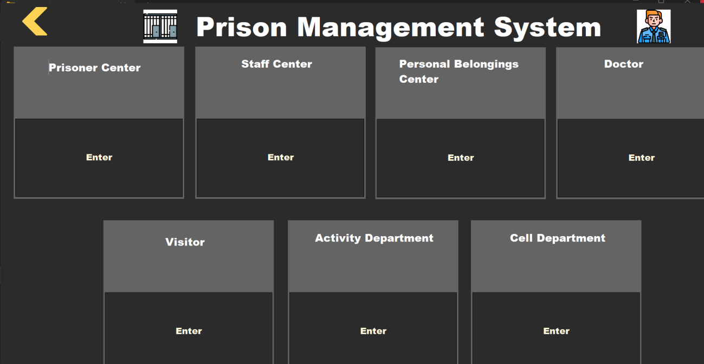

### Visitor and Visit Analytics

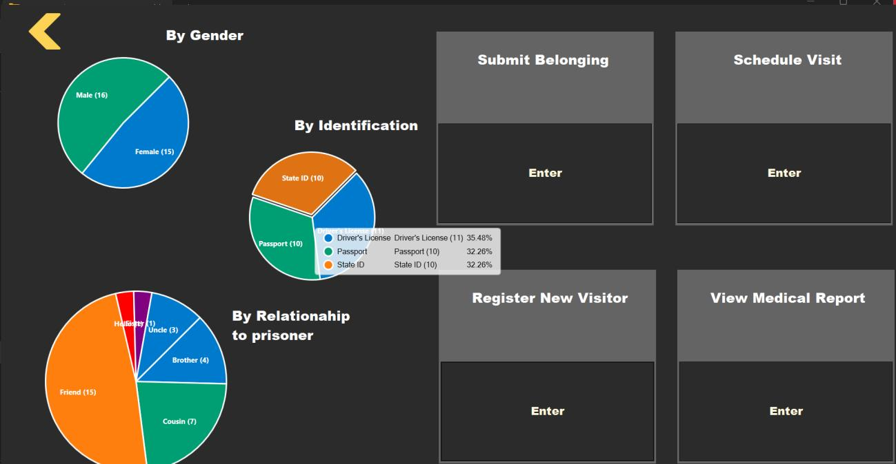

### Activity and Cell Analytics

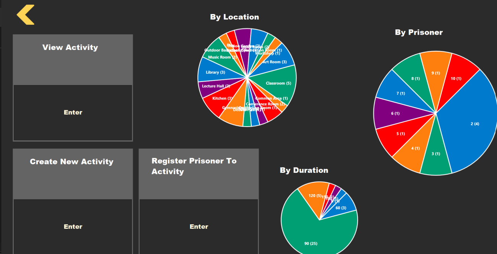

### FIR Module

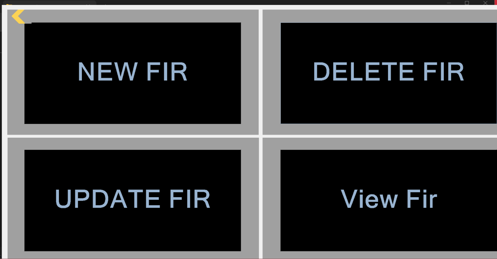

### Complaint Registration

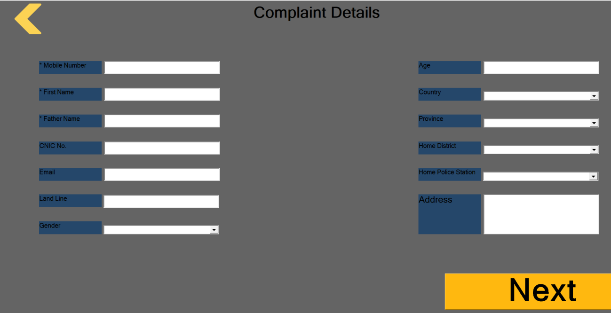

### Crime Records View

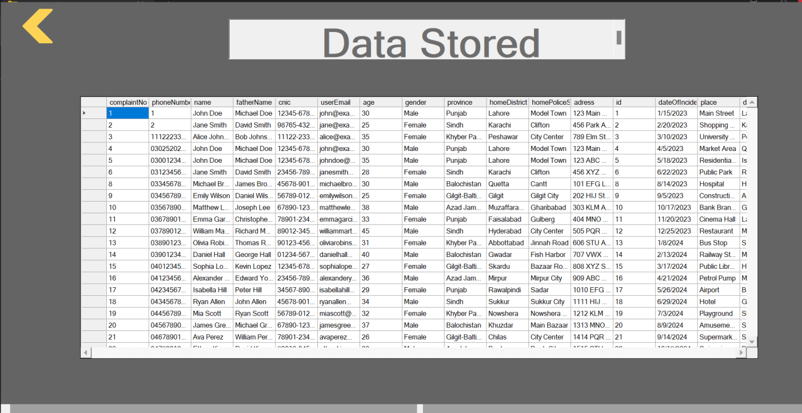

## Core Modules

| Module | What It Handles |
| --- | --- |
| Crime Dashboard | Central navigation and crime-management entry point |
| Crime Input | Crime record insertion into local SQLite storage |
| Crime Trend Analysis | Statistical summaries, charts, and trend screens |
| Geo Map | Location-aware crime visualization using map tooling |
| FIR Management | New FIR, delete FIR, update FIR, and view FIR records |
| Prison Management | Prisoner, staff, doctor, visitor, activity, and cell modules |
| Visitor Management | Visitor registration, scheduling, history, and belongings |
| Cell Management | Cell creation, prisoner assignment, and staff assignment |
| Activity Department | Activity creation, prisoner registration, and activity views |
| Medical Reporting | Doctor records, prisoner checkups, and medical reports |
| Authentication | Signup and login screens backed by local user storage |

## Software Engineering Process

CrimeGuard was built with a sprint-based workflow. The project report documents iteration planning, user stories, Scrum board state, non-functional requirements, boundary value analysis, work division, and lessons learned.

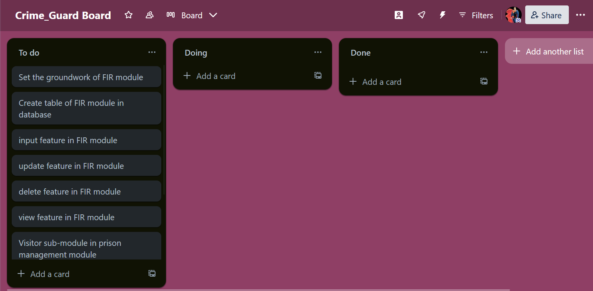

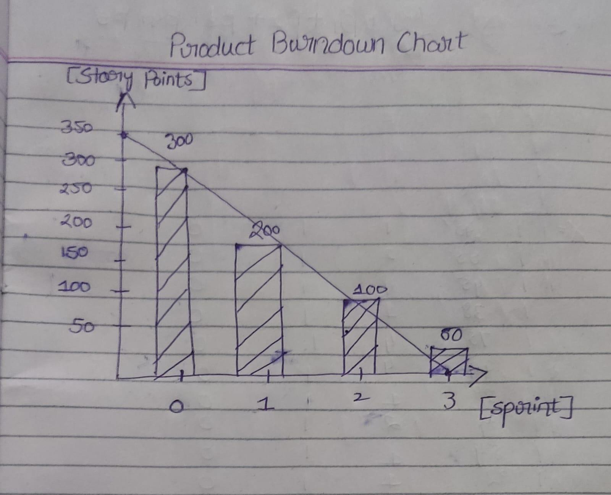

## Architecture

The report describes the system as an **MVC + Layered Architecture**. The app separates UI forms, data-processing/database logic, and module-specific workflows while using local databases for offline data persistence.

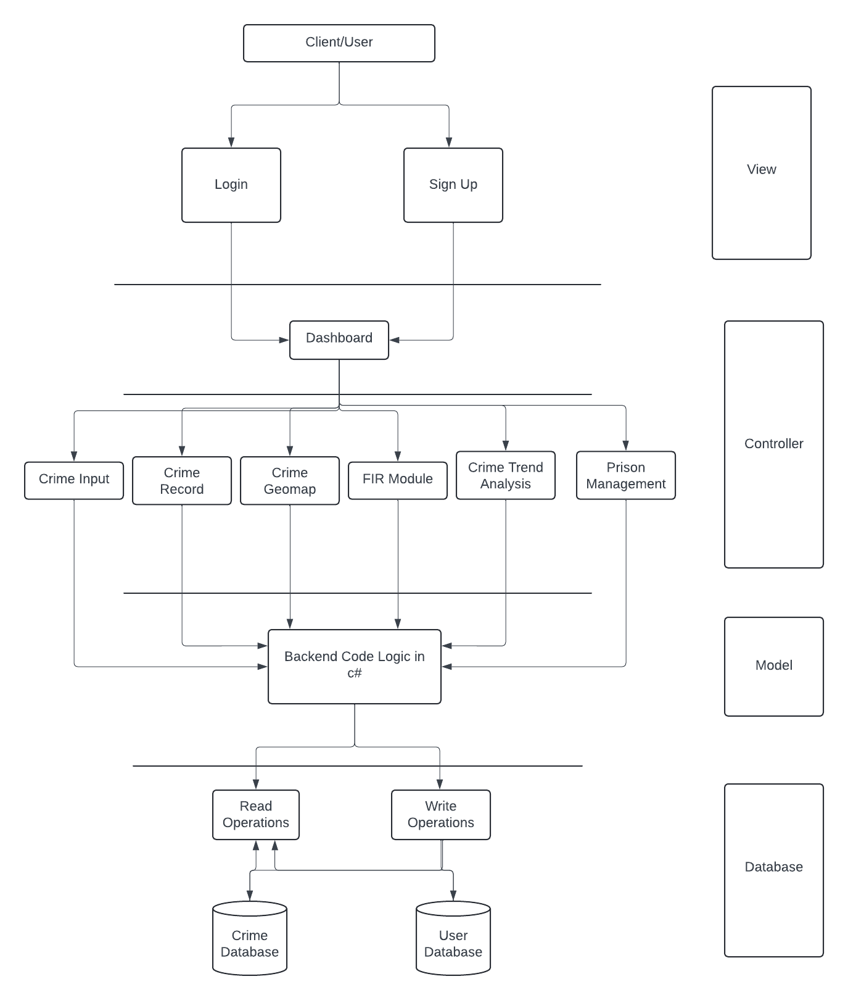

Additional design diagrams from the report:

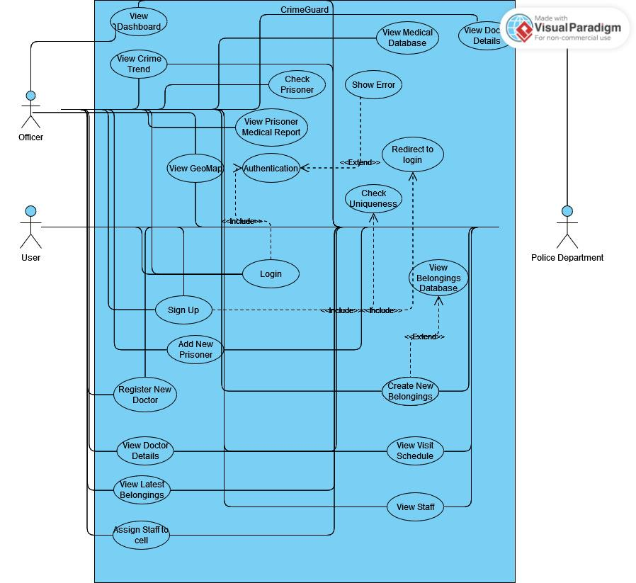

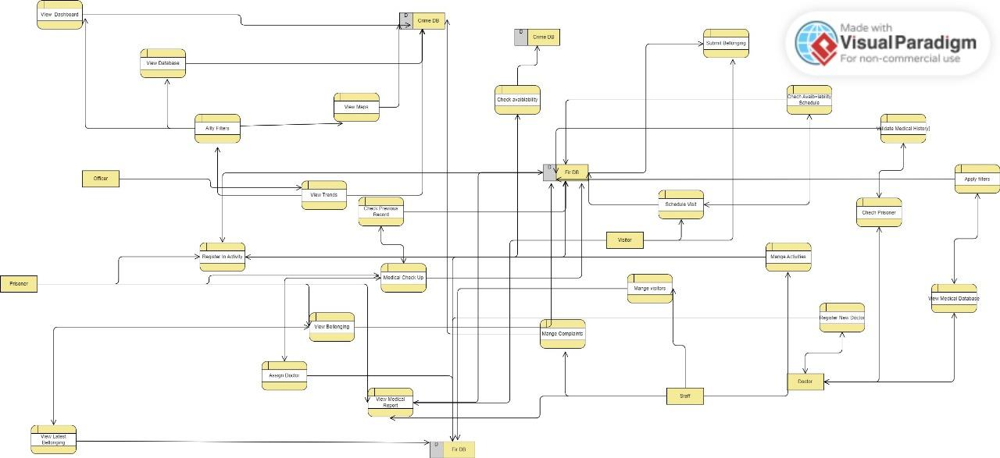

## Tech Stack

- **C#**
- **.NET Framework 4.7.2**
- **Windows Forms / WPF**
- **SQLite**
- **Entity Framework 6**
- **MaterialSkin**
- **LiveCharts**
- **GMap.NET**
- **ML.NET**
- **ONNX Runtime**
- **Python.NET**
- **Visual Studio 2022**

## Repository Structure

```text
crimeguard-software/
├── assets/
│   ├── diagrams/
│   ├── extracted-images/
│   ├── process/
│   ├── report-pages/
│   └── screenshots/
├── reports/
│   └── crimeguard-project-report.pdf
├── src/
│   └── CrimeGuard/
│       ├── Crime App.sln
│       └── Crime App/
│           ├── *.cs
│           ├── *.Designer.cs
│           ├── *.resx
│           ├── *.xaml
│           └── packages.config
└── README.md
```

## Running Locally

This is a legacy Windows desktop project and is best opened in **Visual Studio 2022** on Windows.

1. Open `src/CrimeGuard/Crime App.sln`.
2. Restore NuGet packages from `packages.config`.
3. Ensure local SQLite database files are available for the workflows you want to test.
4. Build with the `.NET Framework 4.7.2` developer tooling installed.

The repository intentionally avoids committing generated build outputs, Visual Studio workspace files, restored NuGet packages, executable binaries, and local database files.

## Project Report

The full Software Engineering report is included here:

[`reports/crimeguard-project-report.pdf`](reports/crimeguard-project-report.pdf)

It contains the original project introduction, team roles, user stories, architectural diagrams, Scrum board screenshots, NFRs, burndown chart, BVA notes, implementation screenshots, work division, and lessons learned.

## Status

CrimeGuard is preserved as a complete academic software engineering project and portfolio case study. It is not hosted because it is a Windows desktop application with Visual Studio, .NET Framework, SQLite, NuGet, and native package dependencies.
